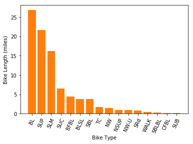

# DataIncubator Project-Studying Boston Bike Lanes for Areas of Improvement

## Project Description
1. As an avid bicyclist, it is my responsibility to continuously complain about how there are not enough bike paths in the city to safely move around.  Instead of complaining, I would love to do something about it, and I feel this could be a pretty neat way to do so.  
1. **Motivation-** There are many reasons that motivate me to study this problem including but not limited to: improving safety for bikers, creating a less stressful situation for drivers so they don’t have to worry about bikers, encouraging alternate modes of transportation, creating a more communal feel to the city, and improving traffic congestion (Boston is routinely ranked worst among traffic).  The last reason is related to the current Covid pandemic.  When the economy reopens, people are going to feel very nervous getting on public transportation.  With the streets relatively empty, this is the perfect time to implement some changes and provide local citizens with a safe and quick alternative to public transit and driving.  
1. **Outcomes-** The types of insights and recommendations I hope to provide from this analysis include: (i) are there smaller/safer streets that we can add bike lanes to (ii) are there streets that are just too dangerous and we should consider removing the bike lane (iii) for these dangerous streets, is it possible to make the bike lane safer by for example, making a separated lane instead of a shared lane (iv) are there areas in Boston that severely lack any bike lanes.
1. **Data Source-** The City of Boston is generally trying to make biking safer and luckily they have plenty of street data/bike lane data to conduct a preliminary analysis and potentially make some recommendations. For now I will be primarily using 2 datasets (this may grow as necessary).  The 1st data set contains info on installed bike lanes in the city. It includes location, unique roadsegmentID, type of road, latitude/longitude, who owns the road, install date, and the type of bike lane(i.e. shared, separated, bus/bike lane), and the segment length. It is both in CSV and GeoJSON format. The 2nd dataset includes every road segment in Boston.  This contains all info as above minus the bike lane data.  In addition, other pertinent information such as speed limit, neighborhood, and elevation data are there.  It is both in CSV and GeoJSON format. 

## Current bike map of Boston

## Some helpful information about the Road Types and Bike Lane types

### FUNCTIONAL - Identifies the functional classification of roadway
  * 0 = Local
  * 1 = Interstate
  * 2 = Principal arterial
  * 3 = Rural minor arterial
  * 5 = Urban minor arterial or rural major collector
  * 6 = Urban collector or rural minor collector

### ExisFacil - Identifies the current bike facility type. See “Bicycle Facility Descriptions” below for further details.

* BFBL = Buffered bike lane 
* BL = Bike lane
* BLSL = Bike lane on one side, shared lane on the opposite side
* BSBL = Bus/bike lane
* CFBL = Contra-flow bike street N
* SUP = Shared use path, natural surface
* NW = Neighborway, marked 
* NW-U = Neighborway, unmarked
* SBL = Separated bike lane 
* SBLBL = Separated bike lane on one side, bike lane on the opposite side
* SLM = Shared lane markings 
* SRd = Shared road
* SUB = Shared use path bridge 
* SUP = Shared use path
* TC = Traffic calmed street 
* WALK = Walkway

### Initial Observations

<b>Total Number of bike lanes in Boston (miles) </b>

       90.29 Miles
       
<b>Total Miles of Road in Boston:</b>

       1165.46 Miles
 
<b> Total Miles of Road in Boston with a speed limit which is 25mph or under </b>

      974 Miles

### Visualization of the type of bike lanes that exist in Boston - by Type

#### Observations 

Bike Lanes, Shared Use Paths and Shared Lane Markings make up the overwhelming majority of bike lanes.  Meanwhile, Buffered Bike Lanes (BFBL) Separated Bike Lanes(SBL) make up only 5 and 4 miles of the entire network respectively.  These represent the safest alternative for on-road biking.  On a positive note, Shared Use Path (SUP), which is the safest alternative overall as it is completely off road, makes up 15 miles of the network.  There is great opportunity for converting Bike Lanes and Shared Lane Marking roads to safer alternatives.

#### Observations 
Of the 1100 miles of roads in Boston, there are only 90 miles of road which have some sort of method to allow for bikes. There are 974 miles of roads in Boston which have a speed limit 25mph or under.  This could be a huge opportunity for the city to consider adding more bike lanes to.  Things such as road width, traffic density, and parking will play a factor, however this is a good starting point to start looking at potential improvements.  
   
